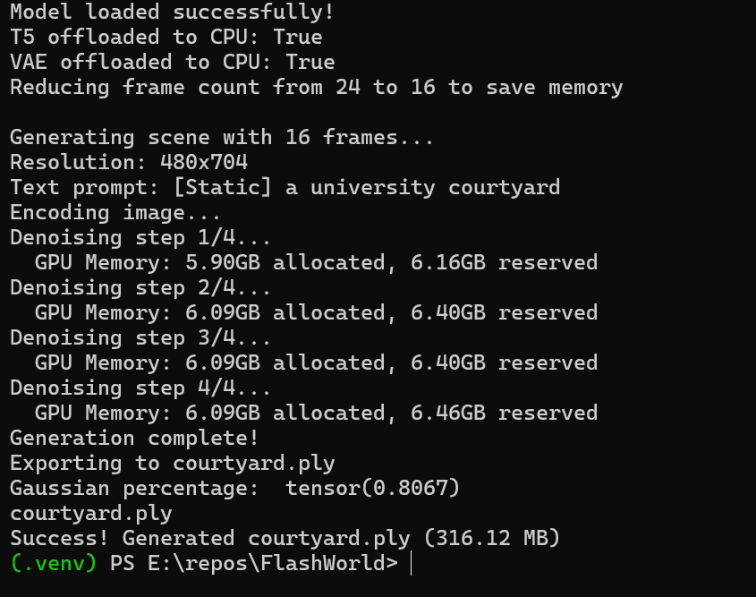
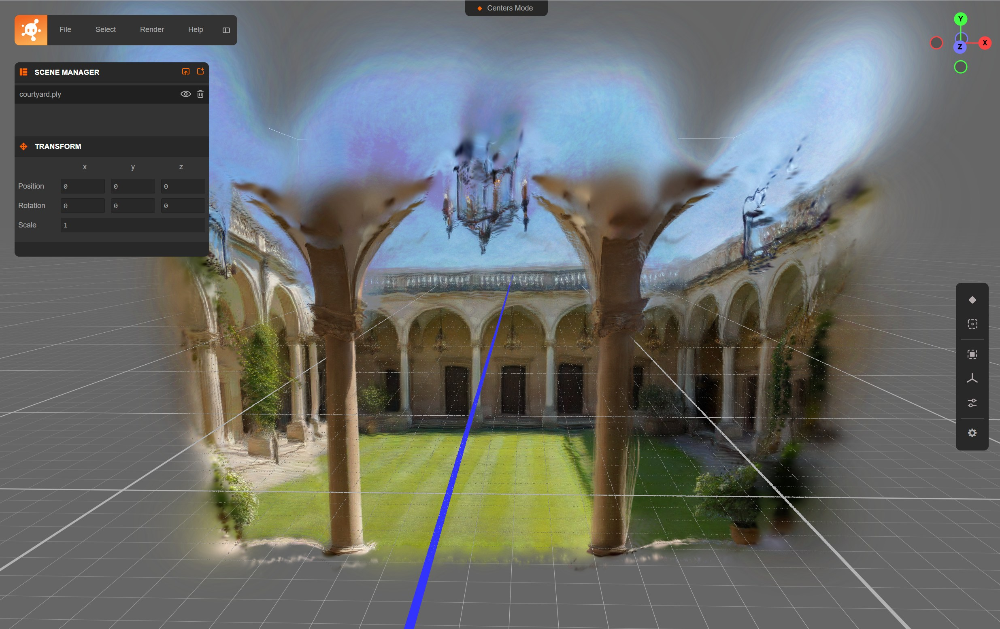

# Minimal Command-Line Examples

This directory contains simplified command-line scripts for testing FlashWorld without the web UI. These are useful for:
- Debugging generation issues
- Batch processing
- Integration into other pipelines
- Testing on systems with limited VRAM

## Quick Start

### Basic Usage (Text-only)

```bash
python test_generate_minimal.py \
  --trajectory demo_trajectory.json \
  --text "a beautiful mountain landscape" \
  --output mountain.ply
```

### With Image Prompt

```bash
python test_generate_minimal.py \
  --trajectory demo_trajectory.json \
  --image input.jpg \
  --text "a cozy living room" \
  --image_index 0 \
  --output room.ply
```

## Memory Optimization Flags

The script includes several flags to reduce VRAM usage, essential for GPUs with <24GB VRAM:

### `--fewer-steps` (Recommended for low VRAM)
Uses 2 denoising steps instead of 4. Faster generation with slightly lower quality.

```bash
python test_generate_minimal.py \
  --trajectory demo_trajectory.json \
  --text "a serene lake" \
  --output lake.ply \
  --fewer-steps
```

### `--no-offload-t5` / `--no-offload-vae`
By default, the T5 text encoder and VAE are offloaded to CPU to save ~7GB VRAM. Use these flags to keep them on GPU for faster processing (if you have enough VRAM).

```bash
# Keep everything on GPU (requires ~24GB+ VRAM)
python test_generate_minimal.py \
  --trajectory demo_trajectory.json \
  --text "mountain vista" \
  --output vista.ply \
  --no-offload-t5 \
  --no-offload-vae
```

### `--no-reduce-frames`
By default, frame count is capped at 16 to save memory. Use this flag to use the full frame count from your trajectory JSON.

## Camera Trajectory JSON Format

The trajectory JSON file defines the camera path and resolution:

```
{
  "resolution": [n_frames, height, width],
  "cameras": [
    {
      "position": [x, y, z],
      "quaternion": [w, x, y, z],
      "fx": focal_length_x,
      "fy": focal_length_y,
      "cx": principal_point_x,
      "cy": principal_point_y
    }
  ]
}
```

### Provided Examples

- **`demo_trajectory.json`**: 3-camera forward motion at 704x480 resolution
- **`demo_trajectory_lowres.json`**: 2-camera trajectory at 512x384 (for low VRAM)

## Memory Requirements

Configuration | Estimated VRAM | Speed | Quality
--------------|----------------|-------|---------
Default (all optimizations) | ~5-7GB | Medium | Good
`--fewer-steps` | ~15-18GB | Fast | Acceptable
Low-res + `--fewer-steps` | ~12-15GB | Fast | Lower
No offloading | ~24GB+ | Fastest | Best

## Troubleshooting

### Out of Memory (OOM) Errors

If you encounter CUDA out of memory errors:

1. **Use `--fewer-steps`** - Reduces denoising iterations
2. **Use lower resolution** - Edit your trajectory JSON to use smaller height/width (e.g., 384x512 instead of 480x704)
3. **Reduce frame count** - Use fewer cameras in your trajectory JSON
4. **Ensure offloading is enabled** - Don't use `--no-offload-*` flags

Example for very limited VRAM (<16GB):
```bash
python test_generate_minimal.py \
  --trajectory demo_trajectory_lowres.json \
  --text "simple scene" \
  --output scene.ply \
  --fewer-steps
```

### Script Hangs During Generation

The script will display memory usage at each denoising step:
```
Denoising step 1/4...
  GPU Memory: 18.45GB allocated, 19.23GB reserved
```

If it hangs, it's likely an OOM issue. Try the solutions above.

## Creating Custom Trajectories

You can create custom camera trajectories by:

1. **Manual JSON editing** - Follow the format in the provided examples
2. **Using the web UI** - Generate a trajectory in the main FlashWorld web UI, then export it to JSON
3. **Programmatically** - Generate camera paths using your own code

### Camera Coordinate System

- Position: [x, y, z] in world space
- Quaternion: [w, x, y, z] for rotation
- Focal length and principal point are relative to image dimensions

### Simple Forward Motion Example

```python
import json

cameras = []
for i in range(5):
    cameras.append({
        "position": [0.0, 0.0, -i * 0.3],  # Move forward
        "quaternion": [1.0, 0.0, 0.0, 0.0],  # No rotation
        "fx": 704.0,
        "fy": 704.0,
        "cx": 352.0,
        "cy": 240.0
    })

trajectory = {
    "resolution": [len(cameras), 480, 704],
    "cameras": cameras
}

with open("custom_trajectory.json", "w") as f:
    json.dump(trajectory, f, indent=2)
```

## All Command-Line Options

```
usage: test_generate_minimal.py [-h] --trajectory TRAJECTORY [--image IMAGE]
                                [--text TEXT] [--image_index IMAGE_INDEX]
                                [--output OUTPUT] [--ckpt CKPT] [--gpu GPU]
                                [--no-offload-t5] [--no-offload-vae]
                                [--no-reduce-frames] [--fewer-steps]

optional arguments:
  -h, --help            show this help message and exit
  --trajectory TRAJECTORY
                        Path to camera trajectory JSON file
  --image IMAGE         Path to input image (optional)
  --text TEXT           Text prompt
  --image_index IMAGE_INDEX
                        Frame index for image condition (default: 0)
  --output OUTPUT       Output PLY file path (default: output.ply)
  --ckpt CKPT          Path to model checkpoint (auto-downloads if not specified)
  --gpu GPU            GPU device ID (default: 0)
  --no-offload-t5      Keep T5 encoder on GPU (uses more VRAM, faster)
  --no-offload-vae     Keep VAE on GPU (uses more VRAM, faster)
  --no-reduce-frames   Use full frame count from JSON (uses more VRAM)
  --fewer-steps        Use 2 denoising steps instead of 4 (faster, less quality)
```

## What you get running the tests
This is an example of memory usage when I ran `test_generate_minimal.py` with an image prompt:

```
python examples/minimal/test_generate_minimal.py --trajectory examples/minimal/demo_trajectory.json --image examples/minimal/image.png --text "a university courtyard" --image_index 0 --output courtyard.ply
```
#### cmd output showing VRAM usage:


#### The output from 3 cameras and only 16 steps (shown in supersplat):


## Contributing

If you create useful trajectory templates or find optimal settings for specific hardware, please consider contributing them back to this directory or ping [@docherty](https://github.com/docherty) and I'll update it.
